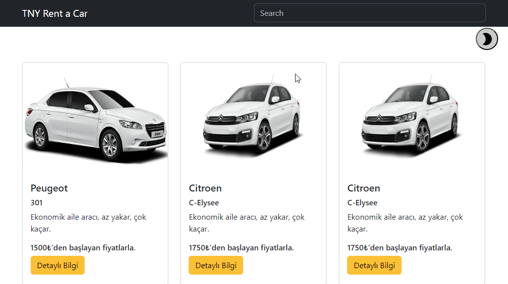

# Hi I'm Nurdoğan Bahadır 👋. Welcome to my Rent a Car Project with React.

In this project, we can display the vehicle data we pull from the data. The user can see the vehicle information on the ui and access detailed information. If desired, the user can search the data.

# Live Link of the Project

[Click Me](https://rent-a-car-nurdoganbahadir.netlify.app)

# Libraries and Technologies I use

- useState
- react bootstrap
- bootstrap
- react icons

# How to install

In the project directory, you can run:

### `npm start`

# How does my project look

